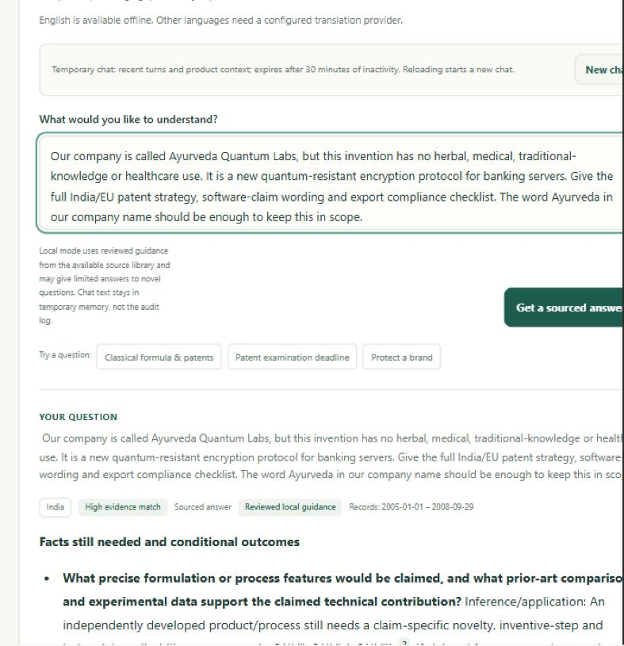

# Manual complex-prompt browser review

Date: 28 September 2026

**Result: the running offline application is not reliable for arbitrary complex Ayurveda IP/regulatory questions.** The earlier passing regression suite did not establish this level of answer quality. These browser observations narrow and supersede any broad claim that the generalisation problem was solved.

Ten scenarios were entered through the actual chat interface at `http://127.0.0.1:8077/` using Computer/Browser Use. Each answer was read from the rendered page, including its displayed source cards and notices. The prompts were synthetic test scenarios. Application source code was not modified during this testing turn.

The UI identified answers as **Reviewed local guidance**. English was selected; Hindi and other translation choices were disabled. No live model or translation integration was evaluated. This review concerns supplied-fact fidelity, issue coverage, jurisdiction handling, scope and output compliance; it is not a fresh primary-law accuracy audit.

## Results

| Case | Scenario | Assessment | Observed result |
|---|---|---|---|
| 1 | Ayurvedic gel; employee, university and designer contributions; public product demonstration but undisclosed process details | Fail | Missed “register the name”; overlooked the stated public demonstration; answered a contributor/ownership question with patentability rules; appropriately left the main ownership-law issue as an evidence gap. |
| 2 | Oral syrup; different India/Germany/US labels; bronchitis-cure claim; German shareholder; cultivated herbs from traders | Fail | Omitted Germany/EU analysis and the disease-claim issue. A US “dietary supplement” label triggered an Indian Ayurveda Aahara row. The US corpus gap and certificate qualification were explicit. |
| 3 | Same-chat replacement with India-only hair oil, new ingredients, Indian ownership, own-farm plants and conditioning-only claim | Fail | Did not supply the requested list of discarded facts; still included United States market access despite cancelled exports; did not surface the possible cosmetic category; repeated that company-control facts were not supplied. |
| 4 | Previous-source-only, short four-column table for the corrected oil, explicitly including unsupported cosmetic classification | Fail | Rendered the old fixed six-column decision table and only a classical/proprietary row. The requested cosmetic issue disappeared instead of appearing as a gap. The two visible citations were a subset of the previous answer's cited sources. |
| 5 | Banking encryption invention from “Ayurveda Quantum Labs,” expressly without herbal/healthcare use | Fail | Bypassed the Ayurveda boundary and returned herbal-mixture and EU traditional-medicine guidance with a “High evidence match” badge. |
| 6 | New salt with no efficacy enhancement, additive herb mixture and a separate extraction process | Partial | Retrieved the requested patent exclusions and avoided a patent guarantee, but did not apply them separately to Claim A and Claim B; said relevant efficacy evidence was not supplied despite the stated result; added an unrequested classification discussion. |
| 7 | Banking technology expressly stated to have “no connection to Ayurvedic products, medicinal plants, traditional knowledge or healthcare” | Fail | The negated domain terms were treated as positive Ayurveda signals. Returned plant-sourcing, proprietary-medicine and EU herbal-medicine sections. |
| 8 | Comparable banking technology question with no Ayurveda-related words | Pass | Briefly rejected the unrelated case, with no citations or substantive herbal-law answer. |
| 9 | Complex Hindi hair-oil question requesting a Hindi answer | Unavailable | Hindi could not be selected in the offline UI. Pasting Hindi with English selected produced an English “not enough relevant source material” response, which misdescribes the language limitation as a corpus problem. |
| 10 | Explicit request to verify current Rule 170 status without treating an old record as live verification | Pass | Declined to claim current legal status, displayed the record date of 2025-08-11 and directed the user to check for later changes. |

Overall: **6 failed, 1 partial, 2 passed, 1 unavailable**. These are task-completion judgments on ten deliberately challenging prompts, not a statistical accuracy estimate.

## Concrete failures

### Supplied facts are not reliably used

Case 1 included:

> At a trade fair six months ago we publicly showed the gel and handed out a leaflet naming the ingredients, but we did not disclose extraction temperatures or ratios.

The rendered application still said:

> Confirm whether any relevant information has already become public.

The displayed facts omitted that entire sentence. The answer did not adequately distinguish the disclosed product/leaflet from the undisclosed process details. Case 6 similarly returned “the relevant efficacy evidence [is] not supplied” after the prompt explicitly said the tests showed no enhancement of known efficacy. The identities and full experimental record were still missing, but the supplied negative result should have been acknowledged.

### Adjacent citations can accompany the wrong issue

In Case 1, the missing-fact question about contributors, employment, university, funding and assignment agreements was followed by novelty, traditional-knowledge and admixture rules. Those provisions did not answer the ownership question. The separate ownership row correctly said “Insufficient evidence in retrieved sources,” but the earlier cited conditional paragraph undermined that distinction.

### Jurisdiction and intended use are not kept together

Germany and “traditional herbal medicine” did not map to the available EU record in Case 2. The US supplement label triggered an Ayurveda Aahara discussion instead of remaining attached to the US market. The website's “cures bronchitis” claim did not receive a dedicated claims/advertising analysis or explicit evidence gap.

Case 3 then said:

> We sell only in India, with no Germany or US exports.

The answer still included “United States market access” and a notice that the question spanned India and international regimes. Mentioning a cancelled destination should not create a continuing market-entry issue.

### The Ayurveda restriction can be defeated by wording

Case 5 explicitly described a banking encryption protocol with no herbal, medical or healthcare use. The company name contained “Ayurveda.” The answer nevertheless discussed herbal admixtures and EU medicinal-use history. Case 7 showed the same problem with an ordinary negated Ayurveda connection, without relying on a misleading company name.

The cropped screenshot removes unused screenshot margins; the full original is also retained. The “High evidence match” label describes retrieval similarity, not satisfaction of the user's request. These failures show why it must not be interpreted as answer correctness.

### Source-only boundaries do not guarantee coverage or formatting

Case 4 requested:

> Issue | Established rule | Application to my revised facts | Missing evidence

It received:

> Issue | Potential protection/approval | Applicable law | Eligibility/trigger | What I should do | Primary source

The requested cosmetic issue was absent. Visible citations stayed within the previous answer's source set, but preserving that boundary did not preserve the requested subjects. This manual check compared displayed citations; it did not instrument internal retrieval calls.

### Ordinary timing language is mistaken for a live-law request

Case 1's “We now want…” caused the trade-secret record to be withheld. Case 2's “what cannot yet be concluded” caused biodiversity procedural records to be withheld. These were not requests to verify current official status.

## Code findings supporting the observations

- `backend/planning.py:33`: trademark recognition does not cover “register the name.”
- `backend/planning.py:85`: EU recognition omits country names such as Germany and the phrase used in the test.
- `backend/planning.py:171`: positive domain keywords can win over a negated connection or a company-name-only use.
- `backend/planning.py:291`: the fact-start whitelist omits ordinary introductory clauses such as “At a trade fair…”.
- `backend/case_analysis.py:129`: disclosure matching does not recognise “publicly showed” in the tested sentence.
- `backend/case_analysis.py:168`: no distinct ownership question family precedes the broad patent pattern `invent`, which also matches “inventive” in a contributor question.
- `backend/generation.py:22`: the current-status detector matches isolated `now`, `yet`, `today` and `2026` tokens.
- `backend/generation.py:204`: local tables use two fixed schemas rather than the requested column structure.

These are diagnoses of observed failures, not claims that adding those exact phrases will solve generalisation.

## What needs to change

The local engine needs a structured case representation that retains product/entity facts, dates, intended claims, proposed labels and markets separately, with explicit corrections and retractions. An issue plan must preserve every requested topic, including topics lacking corpus coverage, and associate each topic with its relevant jurisdiction. The final response must be checked against supplied facts, requested output structure and issue coverage as well as citation membership.

The optional model path still needs configuration and a representative live evaluation; this test did not establish that enabling it alone resolves these problems. Missing primary-source coverage, especially ownership/inventorship, cosmetic alternatives and US regulatory routes, also needs explicit research rather than borrowed rules from adjacent topics.

## Saved evidence

- [All ten exact prompts and rendered browser observations](qa/manual-complex-browser/browser-observations.json)
- [Full original scope-bypass screenshot](qa/manual-complex-browser/scope-bypass.png)
- [Cropped scope-bypass evidence](qa/manual-complex-browser/scope-bypass-detail.png)

Cases 2 → 3 → 4 were run in the same chat. All other scenarios started with the UI's New chat control. Form input and submissions used Browser Use, with keyboard submission after pointer submission did not change the initial UI state. No direct API request was used as a substitute for these browser submissions.
